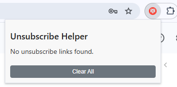
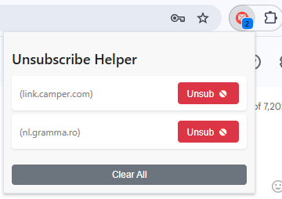
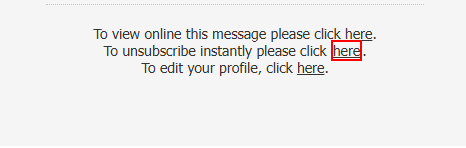

# Unsubscribe Helper Chrome Extension

A simple, effective Chrome extension designed to help you effortlessly unsubscribe from unwanted email newsletters directly within Gmail and Outlook.  


---

## 🚀 Features

- **Automatic detection** of unsubscribe links within emails
- Supports Gmail and Outlook web versions
- Multilingual keyword support for broader compatibility
- Visual indicators to easily identify unsubscribe links
- Convenient popup UI to manage and open unsubscribe links
- Quick unsubscribe button with smooth UI interactions
- Badge count displaying detected unsubscribe opportunities

---

## 📦 Installation

1. Clone or download the repository.
2. Open Chrome and navigate to `chrome://extensions`.
3. Enable "Developer mode" (toggle at the top right corner).
4. Click "Load unpacked" and select the extension folder.

---

## 📸 Screenshots

The extension pinned to Chrome  
  

The extension in action (counter and unsub action available)  
  

Highlighting of the detected unsubscribe links in the email text  
  

---

## 🛠️ How it Works

The extension scans your email inbox pages for unsubscribe keywords and links:

- Keywords include terms like "unsubscribe," "opt out," "dezabonare," and more.
- Detected unsubscribe links are stored locally and shown in a clean, interactive popup.

---

## 🎨 UI & Interaction

- Popup interface for quick management
- Individual unsubscribe buttons to easily navigate to unsubscribe pages
- Clear-all feature to reset the detected list

---

## 📂 File Structure

```
.
├── background.js        # Handles badge updates and background processes
├── content.js           # DOM scanning and detection logic
├── manifest.json        # Extension configuration and permissions
├── popup.html           # User interface markup
└── popup.js             # Popup interface logic
```

---

## 🔖 Permissions

- `storage`: To store detected unsubscribe links locally
- `tabs`: To interact with browser tabs
- Gmail and Outlook domains: Access required to scan and identify unsubscribe links

---

## 💻 Compatibility

- Manifest Version: **3**
- Tested with Gmail and Outlook web apps

---

## 📃 License

MIT License - see [LICENSE](LICENSE) file for details.

---

Enjoy a cleaner inbox! 📬✨
